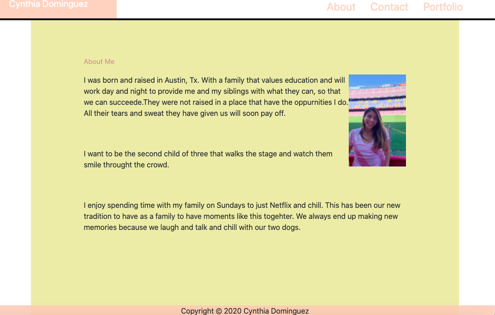
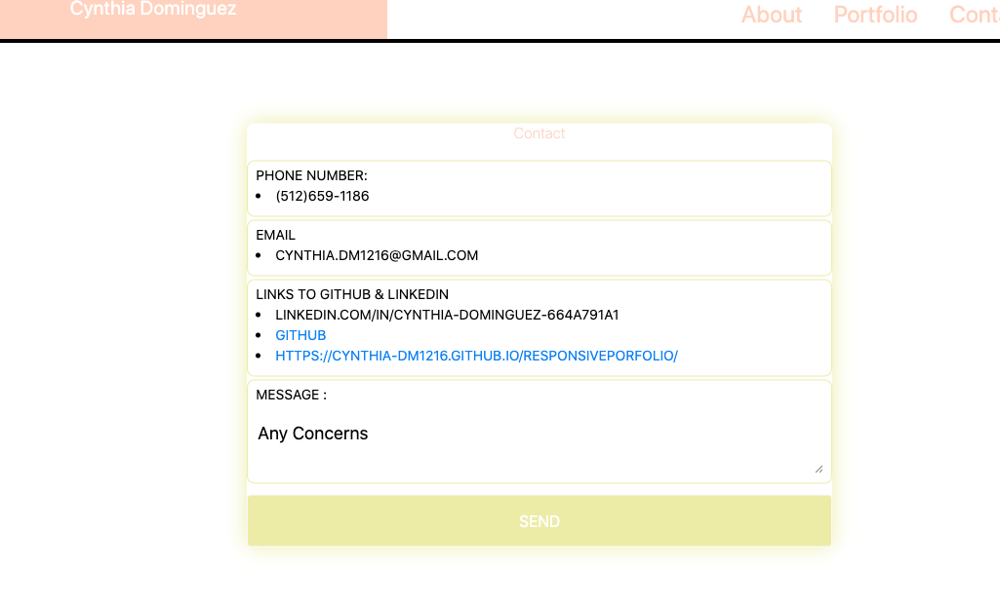

# ResponsivePorfolio

`A portfolio with a resume,Github and LinkedIn profile`

A homework assignment where I updated my portfolio to feature the first project and Homework assignments.

## Complete

* Created the following files: `index.html`, `portfolio.html` and `contact.html`.

* Using Bootstrap, and UIkit I developed my portfolio with the folowing Items:

   * A navbar

   * A responsive layout

   * Responsive images
   
   * A sticky Footer

   * A link to LinkedIn profile

   * A Resume

## Deployed Link
* [Deployed Link](https://cynthia-dm1216.github.io/ResponsivePorfolio/)

## ScreenShots

- - -

© 2019 Trilogy Education Services, a 2U, Inc. brand. All Rights Reserved.

